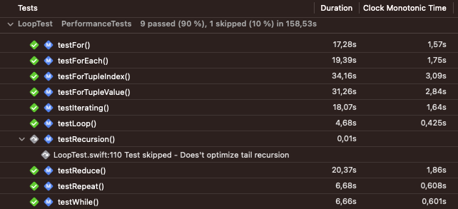
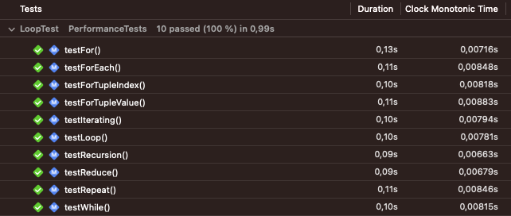
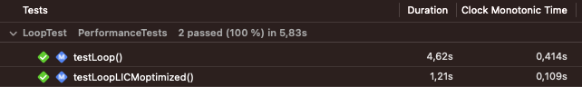
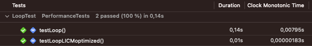
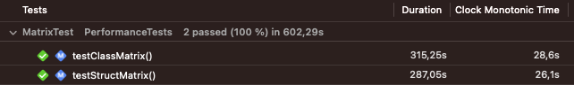
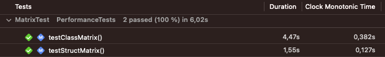
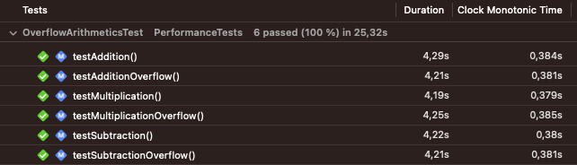
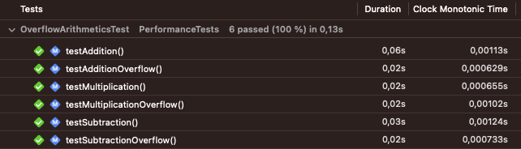

# Performance

Performance measurements were made using XCTest.
There are two schemes for building and running tests. Their main difference in `Swift Compiler - Optimization Level`
- Test unoptimized scheme uses `-Onone`
- Test optimized scheme uses `-O`

Optimization Level significantly affects the speed of mass calculations, which will be seen below.

## Loops

If you asked yourself the question “Which loop is faster?”, then it will be interesting for you to look at the following results.

*Unoptimized*

These results only confuse. Look next.

*Optimized*

The difference in methods is no longer so significant, which allows us to concentrate on choosing a more convenient method and not think about speed.

#### Recursion

Note that in the Unoptimized results, the recursive method test is skipped to avoid call stack overflow, even though it is implemented using tail recursion.
Without optimization, tail recursion results in the same call stack overflow as regular recursion.

#### [LICM](https://en.wikipedia.org/wiki/Loop-invariant_code_motion)

If the values in the loop are explicit, this mechanism allows you to reduce the loop.

Instead of +1 n times, he does *n once.

*Unoptimized*

*Optimized*

## Struct or Class

*Unoptimized*

*Optimized*

`Class` references are very handy when we need to change the same state from different places.
But `Struct` shows the best results.

## Overflow Arithmetics

*Unoptimized*

*Optimized*

Optimized results show the efficiency of using overflow operators.

## Hardware

These test performed on Intel Kaby Lake processor and the result can be very different on the other.
